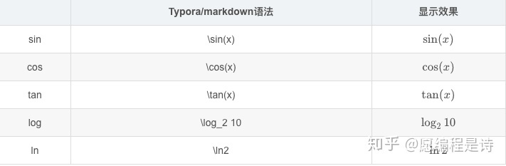
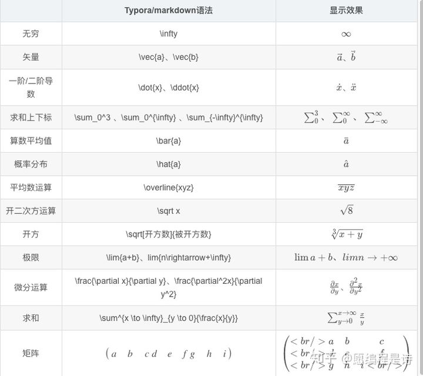
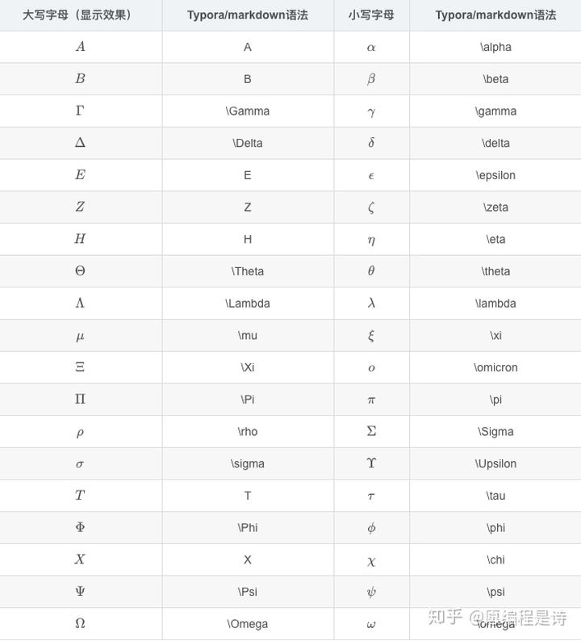
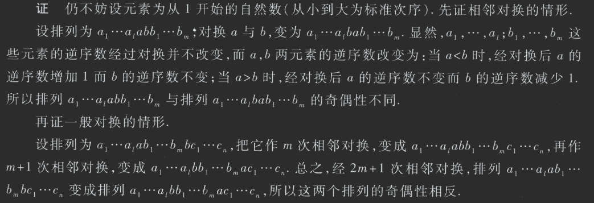
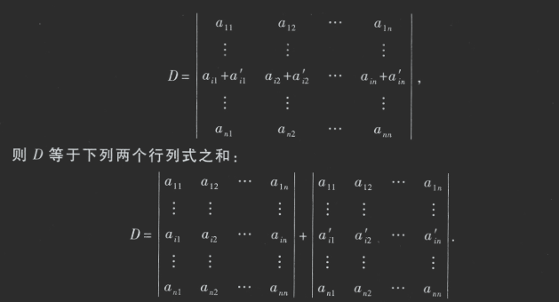
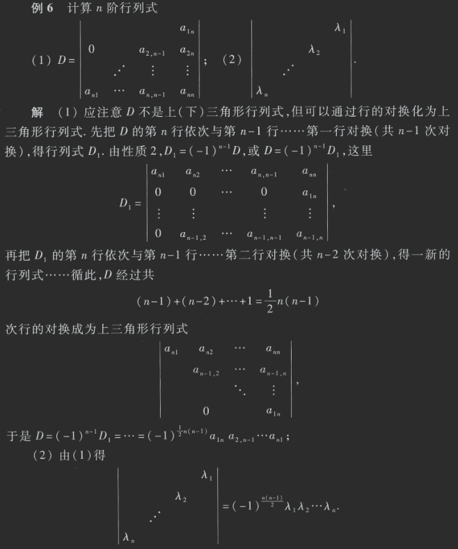

# 线性代数

# 数学表达式

Typora支持加入用LaTeX写成的数学公式，并且在软件界面下用MathJax直接渲染，数学公式分为两种参考**[Mathpix Snip](https://link.zhihu.com/?target=https%3A//mathpix.com/)**

- 行内公式 `$ ... $`
- 行间公式 `$$ ... $$`,（或者$$+回车）
  **注**：行间公式形式是将数学式插在文本行之间（多行公式、公式组和微积分方程等复杂的数学式都是采用行间） **注**：行内公式形式是将数学式插入文本行之内（适合编写简 短的数学式） **如**：将公式插入到本行内，符号：`$公式内容$`，$xyz$或“$$”+回车即可

## 1、上标、下标、求和、括号、分式、根号

**语法**：行内公式输入在两个`$$`之间，行外公公式`$$内容公式$$`或`$$`+回车即可输入。

## 2、基本运算符

## 3、三角函数、指数、对数

## 4、高等数学相关运算符

## 5、希腊字母

# 1 行列式

## 1.1 序数

- **序数定义**
  - n个元素的任一排列中，当某一 对元素的先后次序与标准次序不同时，就说它构成1 个逆序.一个排列中所有逆 序的总数叫做这个排列的逆序数.
  - 逆序数为奇数的排列叫做奇排列，逆序数为偶数的排列叫做偶排列.

> **定理 1**: 一个排列中的任意两个元素对换，排列改变奇偶性.
>
> **推论:** 奇排列对换成标准排列的对换次数为奇数，偶排列对换成标准排列的对换次数为偶数.

- 定义2
  - 设有n 2个数，排成 n 行 n 列的数表, 其结果为$\sum(-1)^ta_{1p_1}a_{2p_2}...a_{np_n}$
  - 其中t为$p_1p_2...p_n$的逆序数
  - 主对角线以下（上）的元素都为 0 的行列式叫做**上（下）三角形行列式**；特别，主对角线以下和以上的元素都为0 的行列式叫做**对角行列式**.

## 1.2 性质

1. 性质 1 行列式与它的转置行列式相等.

2. 性质 2 对换行列式的两行（列），行列式变号.

   > **推论** 如果行列式有两行（列）完全相同，则此行列式等于零.

3. 性质3 行列式的某一行（列）中所有的元素都乘同一数k，等于用数k乘此行列式.

   > **推论** 行列式中某一行（列）的所有元素的公因子可以提到行列式记号的外面.

4. 性质4 行列式中如果有两行（列）元素成比例，则此行列式等于零.

5. 性质5 若行列式的某一行（列）的元素都是两数之和，例如第i行的元素都是两数之和

6. 性质6 把行列式的某一行（列）的各元素乘同一数然后加到另一行（列）对应的元素上去，行列式不变.

- 题目1

  

- 题目2

  

