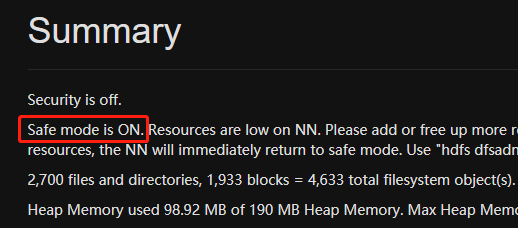
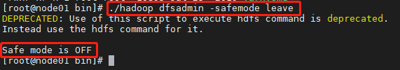
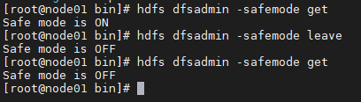
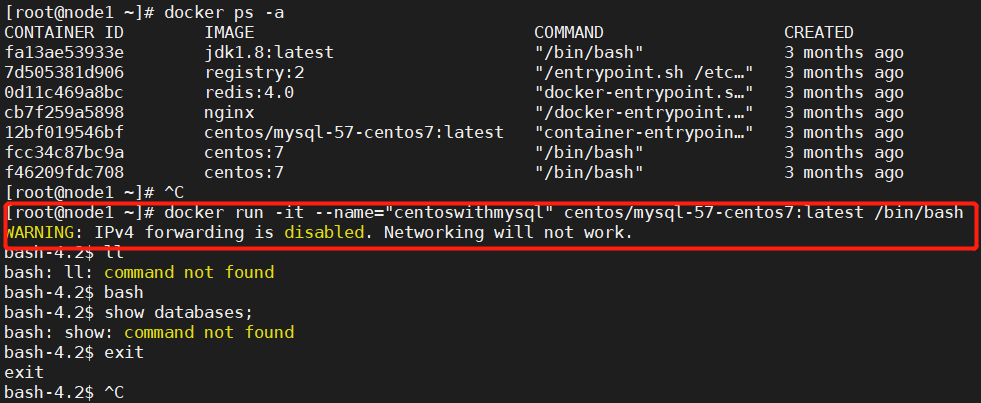
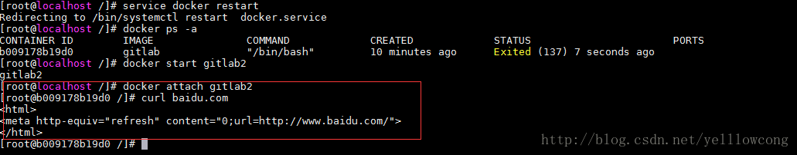

# spark

## 1 spark单机测试配置


## 2 sparkSQL

### 2.1 数据库连接

#### 2.1.1 sqlite

```scala
val jdbcRDD: JdbcRDD[SensorDataGps] = new JdbcRDD(
      sc,
      conn,  // conn: () => Connection
      sql,
      lowBound, upBound, numPartitions,
      rs => {
        val id: Int = rs.getInt(1)
        val car_no: String = rs.getString(2)
        val direction: Int = rs.getInt(3)
        val enable_level: String = rs.getString(4)
        val grid_key: String = rs.getString(5)
        val group: Int = rs.getInt(6)
        val lat: Double = rs.getDouble(7)
        val lng: Double = rs.getDouble(8)
        val loc_time: Int = rs.getInt(9)
        val pm10: Double = rs.getDouble(10)
        val pm25: Double = rs.getDouble(11)
        val satellite_num: Int = rs.getInt(12)
        val sn: String = rs.getString(13)
        val speed: Double = rs.getDouble(14)
        val status: Int = rs.getInt(15)
        val time: String = rs.getString(16)
        val co: Double = rs.getDouble(17)
        val co_f: Double = rs.getDouble(18)
        val so2_f: String = rs.getString(19)
        val no_f: Double = rs.getDouble(20)
        val no2: Double = rs.getDouble(21)
        val o3: String = rs.getString(22)
        val tvoc: Double = rs.getDouble(23)
        val content: String = rs.getString(24)
        SensorDataGps(id, car_no, direction, enable_level, grid_key, group, lat, lng, loc_time, pm10, pm25, satellite_num, sn, speed, status, time, co, co_f, so2_f, no_f, no2, o3, tvoc, content)
      }
    )
```

### 2.2 spark写入csv

应用Hadoop环境时，如果报错

```
org.apache.hadoop.io.nativeio.NativeIO$Windows.createFileWithMode0
```

则将windows系统下的hadoop的bin目录中和Windows/System23目录中的hadoop.dll文件删除即可

2.3 spark连接hdfs上sqlite数据库路径写法

```scala
val url = "jdbc:sqlite::resource:hdfs://node01:8020/SparkData/sensordata/sensordatagps_2020-12-10_00-00-00_1.db"
```

|注意：此处要加`:resource:`

# hadoop

## 1 配置Hadoop本地开发环境

解压hadoop-2.7.5

添加环境变量HADOOP_HOME和CLASSPATH，以及bin

将bin下的hadoop.dll放到c://Windows/System32下

## 2 hadoop的安全模式



此时，禁止写入和删除hdfs文件，需要离开安全模式才可以





## 3 yarn资源释放

```shell
#查看当前yarn资源占用
yarn application -list
#kill应用
yarn application -kill 应用id
```

# java

1 SimpleDateFormat高并发异常

```java
java.lang.NumberFormatException: For input string: ""
```

SimpleDateFormat(下面简称sdf)类内部有一个Calendar对象引用,它用来储存和这个sdf相关的日期信息,例如sdf.parse(dateStr), sdf.format(date) 诸如此类的方法参数传入的日期相关String, Date等等, 都是交友Calendar引用来储存的.这样就会导致一个问题,如果你的sdf是个static的, 那么多个thread 之间就会共享这个sdf, 同时也是共享这个Calendar引用

# flink

## 1 双流join、connection和CoProcessFunction


# kafka

## 1 Kafak JDBC连接


# docker

## 1 进入容器, 报错WARNING: IPv4...



没有开启转发,网桥配置完后，需要开启转发，不然容器启动后，就会没有网络，配置`/etc/sysctl.conf`,添加`net.ipv4.ip_forward=1`

```shell
vim /etc/sysctl.conf

#配置转发
net.ipv4.ip_forward=1

#重启服务，让配置生效
systemctl restart network

#查看是否成功,如果返回为“net.ipv4.ip_forward = 1”则表示成功
sysctl net.ipv4.ip_forward
```

检查容器是否正常访问网络

```shell
#重启docker服务
service docker restart 

#查看运行过的容器
docker ps -a

#启动gitlab 容器
docker start gitblab2 

#进入gitlab容器
docker attach gitlab2

#获取百度信息
curl baidu.com
```



